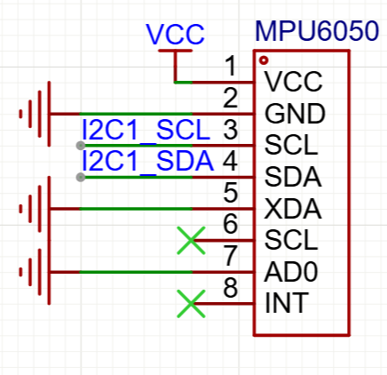
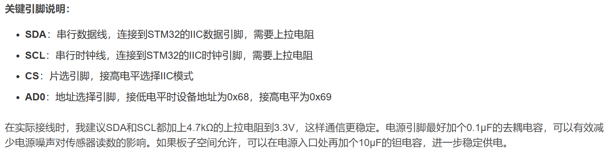

[toc]

# 1. 引脚配置

## 1-1 板载引脚

| 引脚号 | 标签号(模糊标签) | 备注    |
| ------ | ---------------- | ------- |
| PB   22   | LED_PIN_0        | 板载LED |
| PB   21   | KEY_0            | 板载KEY |

## 1-2 普通GPIO

| 引脚号 | 标签号(模糊标签) | 备注                     |
| ------ | ---------------- | ------------------------ |
| PA31   | OLED_SCL         | 其实也是IIC,但是是软驱动 |
| PA28   | OLED_SDA         |                          |
| ×      | KEY_0            | 在板载引脚部分           |
| PA15   | KEY_1            |                          |
| PA17   | KEY_2            |                          |
|        |                  |                          |
| PB   6 | **LED_R**        | 红灯                     |
| PB   7    | **LED_G**        | 绿灯                     |
| PB   8    | **LED_B**        | 黄灯                     |
| ==PB   9== | **LED_Time**     | 时间检测GPIO口           |
| PB 23      | Buzzer           | 蜂鸣器(+5V)                 |
| PB 24      | Elec             | 电磁铁(+5V + GND)(IO + GND) |

## 1-3 电机控制配置

| 引脚号 | 标签号(模糊标签) | 备注         |
| ------ | ---------------- | ------------ |
| PB   4    | A_IN_1           | PWM          |
| PB   12   | A_IN_2           | 普通驱动     |
| PB   14   | A_Encoder_1      | 外部中断驱动 |
| PB   1    | A_Encoder_2      | 外部中断驱动 |
|        |                  |              |
| PB   5    | B_IN_1           | PWM          |
| PB   13   | B_IN_2           | 普通驱动     |
| PB   11   | B_Encoder_1      | 外部中断驱动 |
| PB   10   | B_Encoder_2      | 外部中断驱动 |

## 1-4 UART配置

| 引脚号 | 标签号(模糊标签) | 备注                                  |
| ------ | ---------------- | ------------------------------------- |
| PA10   | UART_0_TX        | USB可读写,作为调试端口,**引脚不可变** |
| PA11   | UART_0_RX        |                                       |
|        |                  |                                       |
| PA8    | UART_1_TX        | 与树莓派进行通信                      |
| PA9    | UART_1_RX        |                                       |
|        |                  |                                       |
| PB   15   | UART_2_TX        | 使用蓝牙进行双车通信                  |
| PB   16   | UART_2_RX        |                                       |
|         |                  |                                       |
| PA 26   | UART_3_TX        | 串口屏 |
| PA 25   | UART_3_RX        | |

## 1-5 IIC配置

| 引脚号 | 标签号(模糊标签) | 备注  |
| ------ | ---------------- | ----- |
| PA1    | AT_SCL         | IIC_0，给外存AT |
| PA0    | AT_SDA          |       |
|        |                  |       |
| PB   2    | MPU6050_SCL      | IIC_1 |
| PB   3    | MPU6050_SDA      |       |

## 1-6 寻迹模块配置

+ 2Pin + 8Pin

| 引脚号 | 标签号(模糊标签) | 备注     |
| ------ | ---------------- | -------- |
| PA 22  | Y8_CLK           | GPIO输出 |
| PB 20  | Y8_DAT           | GPIO输入 |
|        | +5V              | +5V      |
|        | GND              | GND      |

## 1-7 旋转编码器配置

+ 旋转编码器
  + 5个Pin

| 引脚号 |  Label   |        备注        |
| :----: | :------: | :----------------: |
| PA 16  | EC11_S1  |      外部触发      |
| PA 12  | EC11_S2  |      外部触发      |
| PA 14  | EC11_Key | 旋转编码器搭配按键 |

## 1-8 陀螺仪

+ 可以直接使用IIC驱动，直接配置成与MPU6050兼容

| 引脚号 |  Label  |           备注           |
| :----: | :-----: | :----------------------: |
|        | ICM_SCL | IIC_1，和MPU6050等价位置 |
|        | ICM_SDA |                          |

## 1-9 步进电机

+ 云台1

| 引脚号 | Label |              备注               |
| :----: | :---: | :-----------------------------: |
|   /    |  V+   |              接12V              |
|   /    |  Gnd  |              接GND              |
|  3V3   |  Com  |              接3V3              |
| PA 18  |  En   |       使能(GPIO推挽输出)        |
| PA 21  |  Stp  | 停止(脉冲,**PWM**) ==TIM9_CH1== |
| PB 17  |  Dir  |           方向(GPIO)            |
|   /    | R/A/H |      暂时不接，但是要占位       |
|   /    | T/B/L |      暂时不接，但是要占位       |

+ 云台2

| 引脚号 | Label  |               备注               |
| :----: | :----: | :------------------------------: |
| 引脚号 | Label  |               备注               |
|   /    |   V+   |              接12V               |
|   /    |  Gnd   |              接GND               |
|   /    |  Com   |              接3V3               |
| PB 18  |  En2   |        使能(GPIO推挽输出)        |
|  PA23  |  Stp2  | 停止(脉冲,**PWM**) ==TIM12_CH1== |
| PB 19  |  Dir2  |            方向(GPIO)            |
|   /    | R/A/H2 |       暂时不接，但是要占位       |
|   /    | T/B/L2 |       暂时不接，但是要占位       |

## 1-10 舵机

+ 建议舵机配置时5V和可变电压都列入考虑范围，并且接入降压部分而不是STM32脚防止供电不足抖动

| 引脚号 |   Label    | 备注 |
| :----: | :--------: | :--: |
|  PA29  | PWM_Servo1 | CH0  |
|  PA2   | PWM_Servo2 | CH1  |

