# TI-G3507配置表

[toc]

* 注意事项：
  * 工程的编译优化等级记得开启为最低!!!否则自设库的全局变量会被优化，导致函数停滞甚至跳转到硬件故障中断
  * 工程重新改变地址或者重命名，会导致自设库的位置与工程的定位发生变化（绝对路径发生变化），所以需要重新配置自设库的路径

## 0. 工程基础配置

### 0-1 新建工程

* import projects
* 寻找drivelib的空工程：empty


### 0-2 使用`Jlink`开发

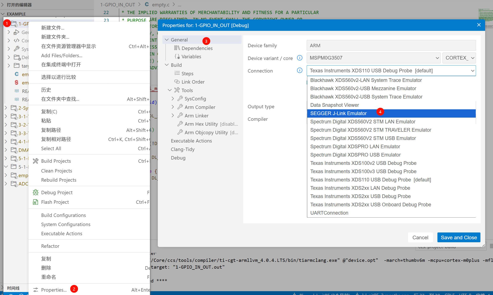


### 0-3 引入函数库

* 进入Properties


* 添加路径和文件


新建文件夹：


* 添加文件夹到工程


最后两步：


### 0-4 配置程序代码优化等级

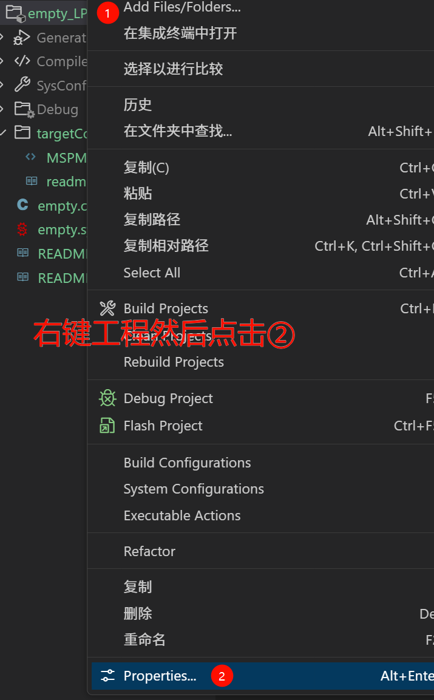

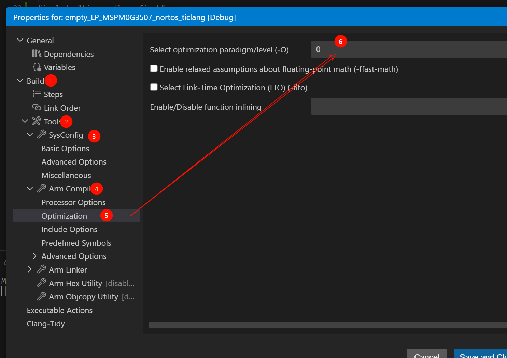


## 1. GPIO

### 1-1 GPIO-输出

* 初始状态注意一下（天猛星的板载LED为PB22）


### 1-2 GPIO-输入

* 记得上下拉（天猛星的板载按键为PB21）


## 2. Systick循环中断

* Sys遵循的时钟：MCLK，而MCLK遵循的是SYSOC：32MHz，所以最终SYS的频率为32MHz


* 配置


* 基础代码

```c
void SysTick_Handler(void)
{
    // 操作
    
}
```


## 3. TIM

### 3-1 TIM-中断定时

* 一些讲解

  * TIMA0是时钟源，与STM32不同，我们不需要太刻意关注时钟源，因为周期可以自己写，系统会配置PSC和ARR

  * 关于分频：Clock Config
    * 频率越低，计数最大时间越长
    * 频率越高，计数最小时间越小
    * 分频有两个选项都能设置
    
    * 优先级自己配

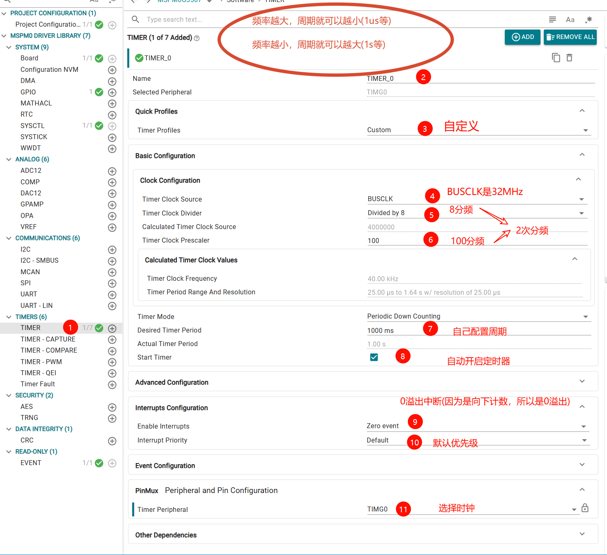

* 基础代码

```c
// 注意：根据中断名字进行配置：TIMERx

// setup
// 1. 清除定时器中断标志
NVIC_ClearPendingIRQ(TIMER_0_INST_INT_IRQN);
// 2. 使能定时器中断
NVIC_EnableIRQ(TIMER_0_INST_INT_IRQN);

// 自定义：__week
void TIMER_0_INST_IRQHandler(void)
{
    //如果产生了定时器中断
    switch( DL_TimerG_getPendingInterrupt(TIMER_0_INST) )
    {
        case DL_TIMER_IIDX_ZERO://如果是0溢出中断
            //将LED灯的状态翻转
            DL_GPIO_togglePins(LED1_PORT, LED1_PIN_14_PIN);
            break;

        default://其他的定时器中断
            break;
    }
}
```

### 3-2 TIM外部中断

* 参考资料：https://blog.csdn.net/wxg_wuchujie88/article/details/149454292

* 先介绍MSPM0的事件系统：
  * **Publisher（发布者）**：产生事件的外设
  * **Subscriber（订阅者）**：响应事件的外设
  * **Channel（通道）**：事件传播的“线路”

```c
GPIO / Timer / ADC
        ↓
   Event Channel // 所以Subscriber不会知道是谁发布的事件，只知道事件触发了
        ↓	     // 事件通道的分配策略：结果相同，通道可以相同：比如3个按键都是触发一个功能，那么通道就给一样
 PWM / Timer / DMA / Comparator

```

***

* 外部触发中断逻辑

* 外设中断分组


​	看的出来，GPIO的外部中断都被分在了GROUP1中，所以后续也是调用`GROUP1_IRQHandler`句柄

* ==关于外部中断的核心处理逻辑：（假设PB21触发了外部中断）==
  * 触发：**`GROUP1_IRQHandler`**句柄，**也就是这个小组有人触发了外部中断**
    * 对应实现：`void GROUP1_IRQHandler(void)`
  * 查询端口：GROUP中是**哪一个小队触发了中断**，对于GPIO来说就是检查是**哪一个Port**触发了外部中断
    * 对应函数：`switch (DL_Interrupt_getPendingGroup(DL_INTERRUPT_GROUP_1))`
    * 返回的case最重要的就是查询是A还是B触发的
      * `case DL_INTERRUPT_GROUP1_IIDX_GPIOA:`  // GPIOA中断
      * `case DL_INTERRUPT_GROUP1_IIDX_GPIOB:`  // GPIOB中断
  * 查询引脚：查询到了是`PortB`触发的，再去找是PB几，**也就是寻找小队里面的队员**
    * case下的对应函数：`uint32_t status = DL_GPIO_getEnabledInterruptStatus(GPIOB);`
    * 这个函数返回的就是引脚号(PIN_21的引脚号就是1<<21)
    * 查询引脚号：`if (status & GPIO_PIN_21) {实现功能}`
  * 实现完成功能记得**清除标志位**
    * `DL_GPIO_clearInterruptStatus(GPIOB ， PBx)`
* 简单来说就是
  * GROUP1函数触发 -> 查GROUP1内端口（A or B） -> 查端口内引脚（0-31）


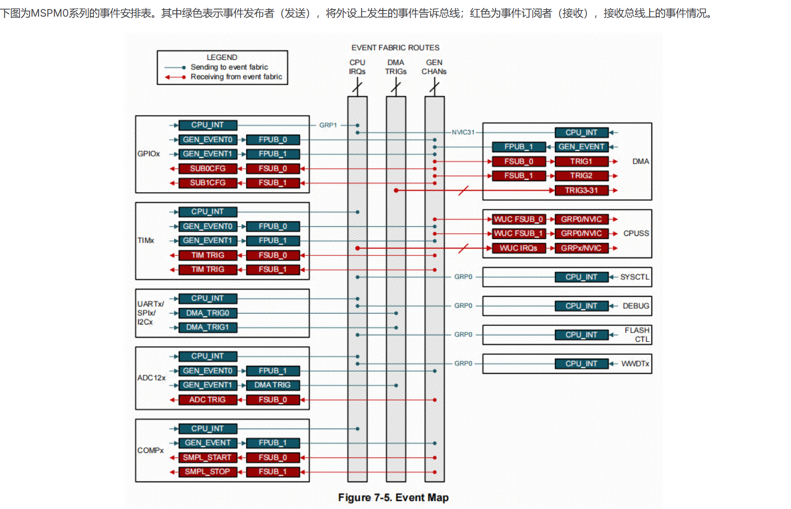


***

* 配置

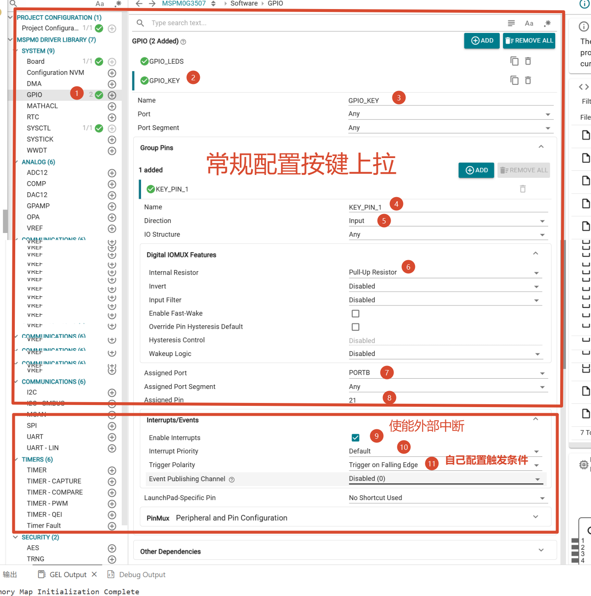


* 基础代码
  * GPIO中断触发都是GRP1线，所以句柄是Group1

```c
// setup
NVIC_EnableIRQ(GPIO_KEY_INT_IRQN); // 开启按键引脚的GPIOA端口中断(上拉按键,下降沿触发)

// GPIO都是Group1的中断服务函数
void GROUP1_IRQHandler(void)
{
    // 读取Group1的中断寄存器并清除中断标志位
    switch( DL_Interrupt_getPendingGroup(DL_INTERRUPT_GROUP_1))
    {
        // 检查是否是KEY的GPIOB端口中断，注意是IIDX，不是IRQN
        case GPIO_KEY_INT_IIDX:
            DL_GPIO_togglePins(GPIO_LEDS_PORT, GPIO_LEDS_USER_LED_1_PIN);
        break;
    }
}
```

### 3-3 TIM输出比较

* 时钟外设选择TIMG0，要在最下面选择


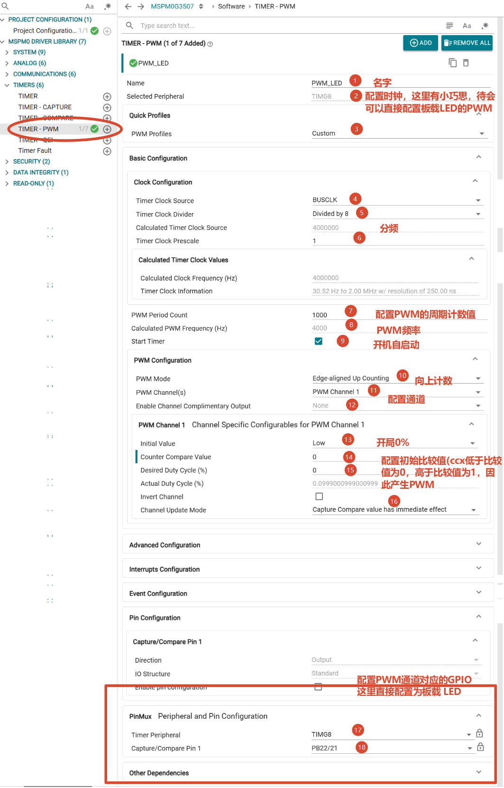


* 基础代码

```c
// setup
DL_TimerG_startCounter(PWM_0_INST);	// 初始化TIM时钟(如果没有设置开机自启动,但是上图设置了，所以不需要本代码)

// while
// 配置占空比:参数：PWM时钟源(INST) , PWM_x , 通道x( Cx_IDX )
DL_TimerG_setCaptureCompareValue(PWM_LED_INST,i,GPIO_PWM_LED_C1_IDX);
// 自定义频率:参数：PWM时钟源 , 频率
DL_TimerG_setLoadValue(PWM_LED_INST , 2000) ;
```


### 3-4 TIM输入捕获

* 使用较少，略

### 3-5 TIM编码器模式

+ 只有一个编码器，功能太少，略写

## 4. USART

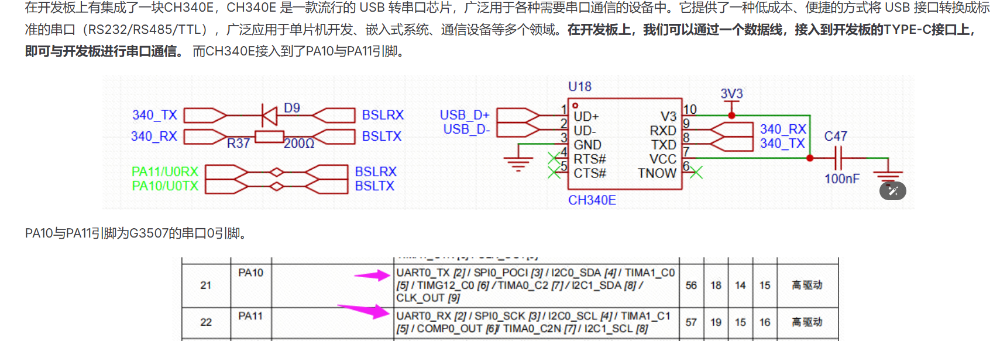

### 4-1 中断式

* 上半部分


* 下半部分


* 示例代码

```c
// setup
// 先清除发送,再使能发送
NVIC_ClearPendingIRQ(UART_0_INST_INT_IRQN);	// 初始化,防止上来就进入中断
NVIC_EnableIRQ(UART_0_INST_INT_IRQN);

// 中断句柄
void UART_0_INST_IRQHandler(void)
{
    switch (DL_UART_Main_getPendingInterrupt(UART_0_INST)) 
    {
        // 接收中断
        case DL_UART_MAIN_IIDX_RX:
            // 必须存储接收到信息,即使不使用,否则中断FIFO存不下，再也进不去中断了
            gEchoData = DL_UART_Main_receiveData(UART_0_INST);  
            uart0_send_char(gEchoData);	// 这是功能函数
            break;
        default:
            break;
    }
}
```

+ 功能函数

```c
//串口发送单个字符
void uart0_send_char(char ch)
{
    //当串口0忙的时候等待，不忙的时候再发送传进来的字符
    while( DL_UART_isBusy(UART_0_INST) == true );
    //发送单个字符
    DL_UART_Main_transmitData(UART_0_INST, ch);
}

//串口发送字符串
void uart0_send_string(char* str)
{
    //当前字符串地址不在结尾 并且 字符串首地址不为空
    while(*str!=0&&str!=0)
    {
        //发送字符串首地址中的字符，并且在发送完成之后首地址自增
        uart0_send_char(*str++);
    }
}
```


### 4-2 DMA-单收模式

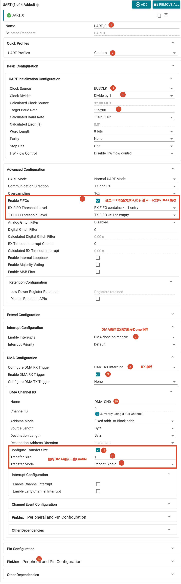


```c
// 初始化

// 本例配置为单个接收
#define UART_PACKET_SIZE 1

// DMA数据接收缓冲数组
volatile uint8_t gRxPacket[UART_PACKET_SIZE];

// DMA数据处理接收一下
uint8_t msg[20];


void USART_Init(void)
{
    // 配置DMA相关参数:DMA名字,通道(USART_x),DMA模式(RX),DMA触发中断大小(必须>=该size才能触发中断),DMA数据接收区等
    DL_DMA_setSrcAddr(DMA, DMA_CH0_CHAN_ID, (uint32_t)(&UART_0_INST->RXDATA));
    DL_DMA_setDestAddr(DMA, DMA_CH0_CHAN_ID, (uint32_t) &gRxPacket[0]);
    DL_DMA_setTransferSize(DMA, DMA_CH0_CHAN_ID, UART_PACKET_SIZE);
    DL_DMA_enableChannel(DMA, DMA_CH0_CHAN_ID);

    // 确保DMA打开
    while (false == DL_DMA_isChannelEnabled(DMA, DMA_CH0_CHAN_ID)) {
        __BKPT(0);
    }

    // 使能中断
    NVIC_EnableIRQ(UART_0_INST_INT_IRQN);
}

// DMA完成搬运中断(单字符搬运后就触发中断)
void UART_0_INST_IRQHandler(void)
{
    switch (DL_UART_Main_getPendingInterrupt(UART_0_INST)) {
        case DL_UART_MAIN_IIDX_DMA_DONE_RX:
            DL_GPIO_togglePins(GPIO_LED_PORT, GPIO_LED_LED_PIN_0_PIN);
            msg[k++] = gRxPacket[0] ;// 这里就接受一下
            break;
        default:
            break;
    }
}
```

## 5. IIC

### 5-1 软件模拟IIC

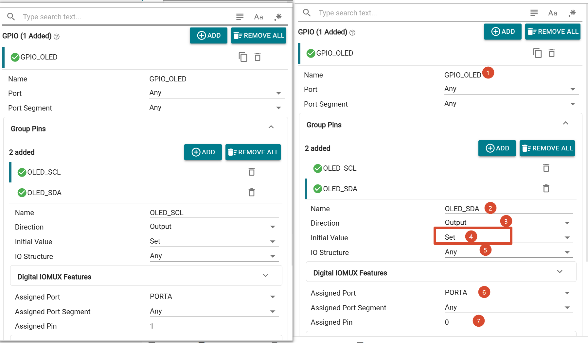

+ 最重要的移植函数
  + 必须要有小延时!

```c
void OLED_W_SCL( uint8_t x )
{
	if ( x )
	{
		DL_GPIO_setPins(GPIO_OLED_PORT, GPIO_OLED_OLED_SCL_PIN);
	}
	else
	{
		DL_GPIO_clearPins(GPIO_OLED_PORT, GPIO_OLED_OLED_SCL_PIN) ;

	}
	for (volatile int i = 0; i < 5; i++);   // 小延时,必须有
}

void OLED_W_SDA( uint8_t x )
{
	if ( x )
	{
		DL_GPIO_setPins(GPIO_OLED_PORT, GPIO_OLED_OLED_SDA_PIN) ;
	}
	else
	{
		DL_GPIO_clearPins(GPIO_OLED_PORT, GPIO_OLED_OLED_SDA_PIN) ;
	}
	for (volatile int i = 0; i < 5; i++);   // 小延时,必须有
}
```


### 5-2 硬件IIC

* 实现OLED显示屏(移植自江协)

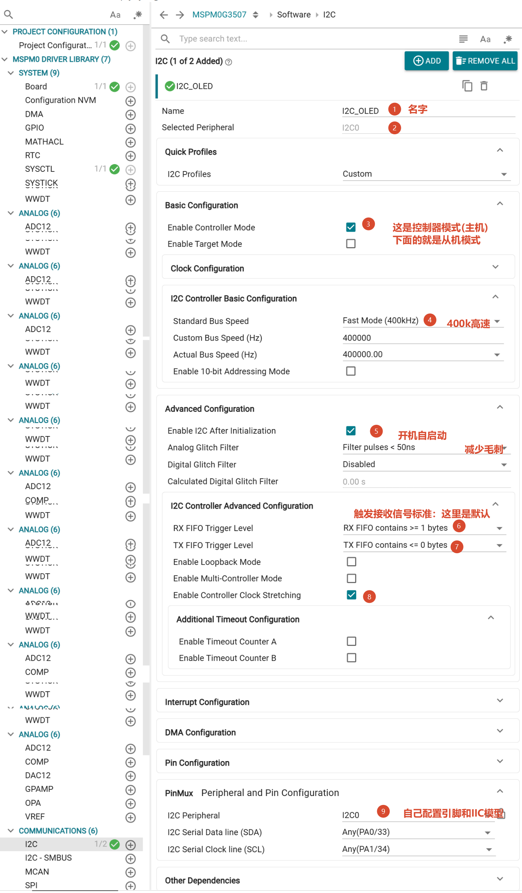


* 代码演示

+ ==OLED发送命令==

```c
void OLED_WriteCommand(uint8_t cmd)
{
    uint8_t buf[2];

    buf[0] = 0x00;   // 控制字节：命令
    buf[1] = cmd;

    // 等待空闲
    while (!(DL_I2C_getControllerStatus(I2C_OLED_INST) & DL_I2C_CONTROLLER_STATUS_IDLE));

    // 写入FIFO
    DL_I2C_fillControllerTXFIFO(I2C_OLED_INST, buf, 2);	// 写2个指令进入FIFO

    // 启动发送 0x3C（7位地址即可）	// FIFO内的指令被发送
    DL_I2C_startControllerTransfer(I2C_OLED_INST,OLED_Addr,DL_I2C_CONTROLLER_DIRECTION_TX,2);

    // 等待完成
    while (DL_I2C_getControllerStatus(I2C_OLED_INST) & DL_I2C_CONTROLLER_STATUS_BUSY);
}
```

+ OLED发送数据(FIFO最大为8,所以发送数据需要分开发)

```c
void OLED_WriteData(uint8_t *Data, uint8_t Count)
{
    uint8_t buf[8];   // FIFO最大8字节

    uint8_t i = 0;

    while (i < Count)
    {
        uint8_t len = (Count - i > 7) ? 7 : (Count - i);
        // 7 = 8 - 1（控制字节占1个）

        buf[0] = 0x40;  // 控制字节

        for (uint8_t j = 0; j < len; j++)
        {
            buf[j + 1] = Data[i + j];
        }

        // 等待空闲
        while (!(DL_I2C_getControllerStatus(I2C_OLED_INST) & DL_I2C_CONTROLLER_STATUS_IDLE));

        // 填充FIFO
        DL_I2C_fillControllerTXFIFO(I2C_OLED_INST, buf, len + 1);

        // 发送
        DL_I2C_startControllerTransfer(I2C_OLED_INST,
            OLED_Addr,
            DL_I2C_CONTROLLER_DIRECTION_TX,
            len + 1);

        // 等待完成
        while (DL_I2C_getControllerStatus(I2C_OLED_INST) & DL_I2C_CONTROLLER_STATUS_BUSY);
		
        i += len;
    }
}
```


## 6. SPI

### 6-1 软件模拟SPI

+ 略


### 6-2 硬件SPI

- 配置

.png)

.png)

.png)

这里需要注意，由于大多数的SPI协议中，整个时序里在发送接收时片选是要一直拉低的，而SPI外设的片选在每次发送和接收完一帧后会拉高，所以CS片选线需要用MCU的IO口独立控制，没有办法使用SPI外设的CS管脚。这里使用GPIO的方式（软件方式）去控制CS引脚的输出。

新建一个GPIO。命名为CS，引脚选择我们现在接入模块CS的引脚PB6。其配置如下：

.png)

基本采用的默认配置，就不加标注了

- 协议的使用

  现在当前工作文件夹（比如empty中新建一个文件夹Hardware），然后新建文件比如命名为bsp_w25q128.c和bsp_w25q128.h（记得在properties-tools-arm compiler-include options里面加上Hardware的文件路径）

  以上操作完成后在bsp_w25q128.h文件里添加如下代码

  ```c
  #ifndef _BSP_W25Q128_H__
  #define _BSP_W25Q128_H__
  
  #include "ti_msp_dl_config.h"
  
  //CS引脚的输出控制
  //x=0时输出低电平
  //x=1时输出高电平
  #define SPI_CS(x)  ( (x) ? DL_GPIO_setPins(CS_PORT,CS_PIN_PIN) : DL_GPIO_clearPins(CS_PORT,CS_PIN_PIN) )
  
  uint16_t W25Q128_readID(void);//读取W25Q128的ID
  void W25Q128_write(uint8_t* buffer, uint32_t addr, uint16_t numbyte);      //W25Q128写数据
  void W25Q128_read(uint8_t* buffer,uint32_t read_addr,uint16_t read_length);//W25Q128读数据
  #endif
  ```

  在bsp_w25q128.c文件里添加

  ```c
  #include "bsp_w25q128.h"
  uint8_t spi_read_write_byte(uint8_t dat)
  {
          uint8_t data = 0;
  
          //发送数据
          DL_SPI_transmitData8(SPI_INST,dat);
          //等待SPI总线空闲
          while(DL_SPI_isBusy(SPI_INST));
          //接收数据
          data = DL_SPI_receiveData8(SPI_INST);
          //等待SPI总线空闲
          while(DL_SPI_isBusy(SPI_INST));
  
          return data;
  }
  ```

  具体应用示例可参考资料https://wiki.lckfb.com/zh-hans/tmx-mspm0g3507/keil-beginner/

## 7. ADC

### 7-1 ADC基本读取

- 上半部分

.png)

- 下半部分

.png)


.png)

- 示例代码

```C
unsigned int adc_getValue(void);//读取ADC的数据

adc_value = adc_getValue();

voltage_value = adc_value/4095.0*3.3;

unsigned int adc_getValue(void)
{
    unsigned int gAdcResult = 0;

    //使能ADC转换
    DL_ADC12_enableConversions(ADC_VOLTAGE_INST);
    //软件触发ADC开始转换
    DL_ADC12_startConversion(ADC_VOLTAGE_INST);

    //如果当前状态 不是 空闲状态
    while (DL_ADC12_getStatus(ADC_VOLTAGE_INST) != DL_ADC12_STATUS_CONVERSION_IDLE );

    //清除触发转换状态
    DL_ADC12_stopConversion(ADC_VOLTAGE_INST);
    //失能ADC转换
    DL_ADC12_disableConversions(ADC_VOLTAGE_INST);

    //获取数据
    gAdcResult = DL_ADC12_getMemResult(ADC_VOLTAGE_INST, ADC_VOLTAGE_ADCMEM_ADC_CH0);

    return gAdcResult;
}

```
