# TI-G3507配置表

[toc]

## 0. 工程基础配置

### 0-1 新建工程

* import projects
* 寻找drivelib的空工程：empty

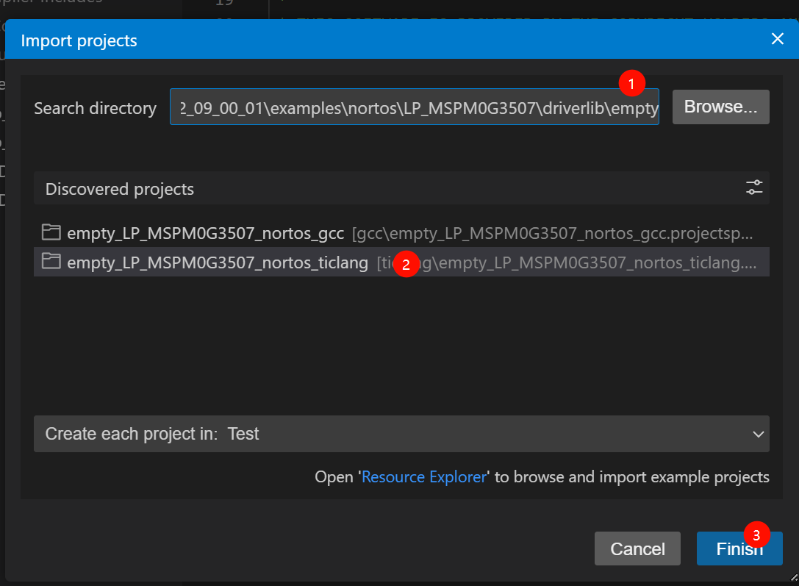

### 0-2 引入库

* 进入Properties

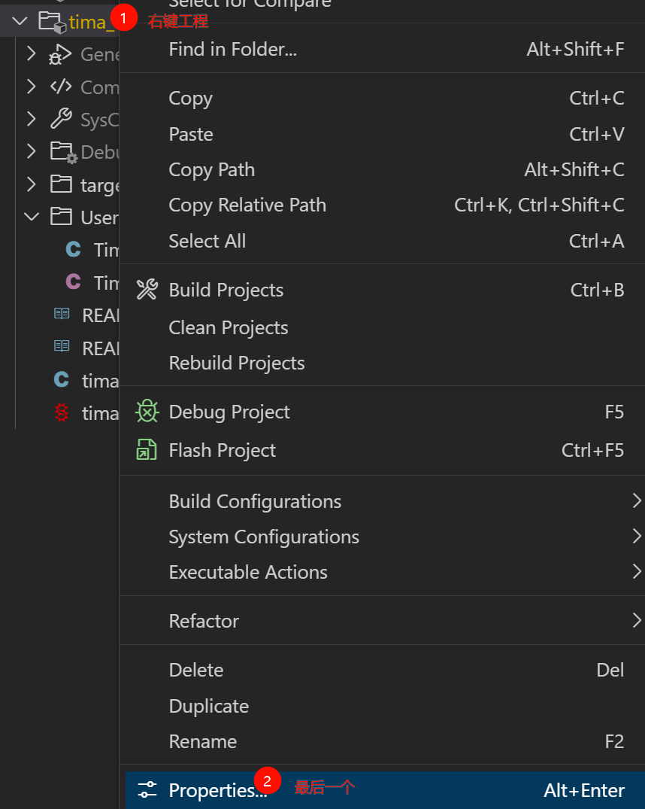

* 添加路径和文件

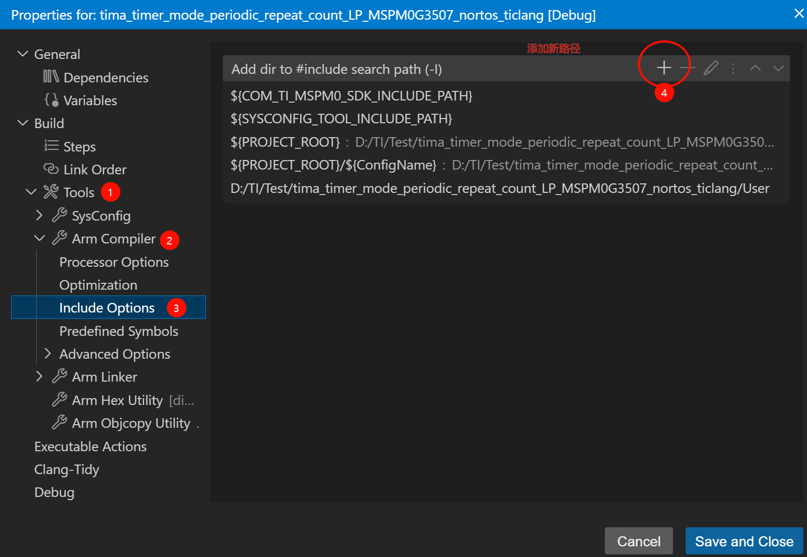

新建文件夹：

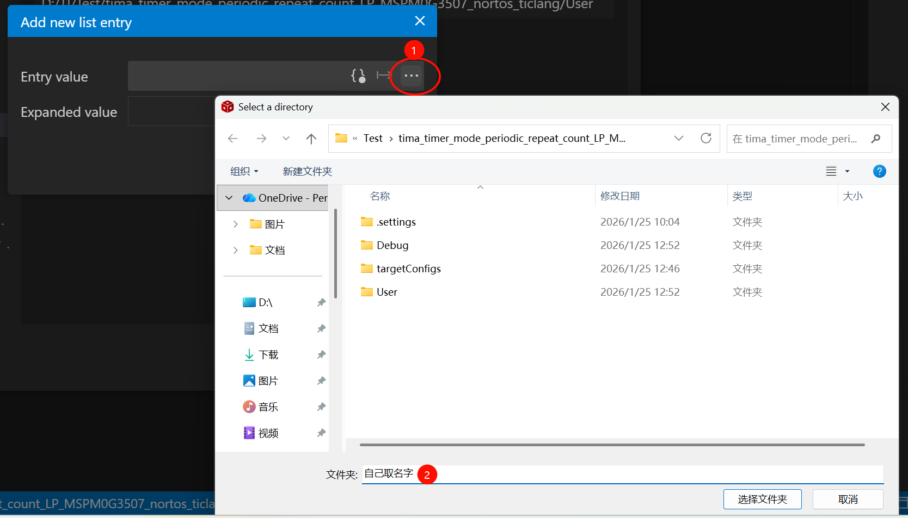

* 添加文件夹到工程

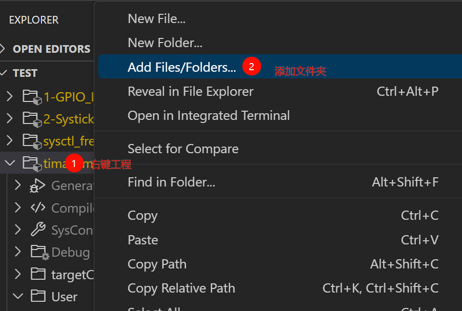

最后两步：

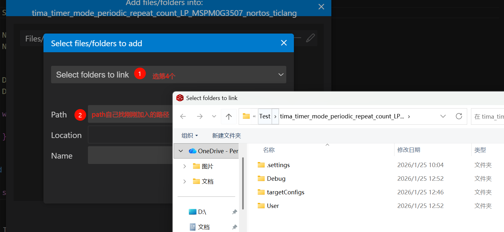

## 1. GPIO

### 1-1 GPIO-输出

* 初始状态注意一下

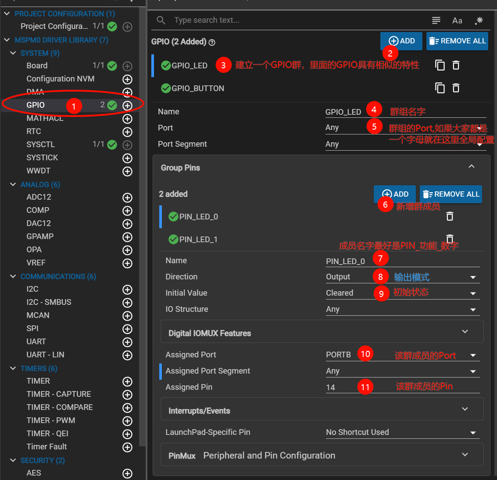

### 1-2 GPIO-输入

* 记得上下拉

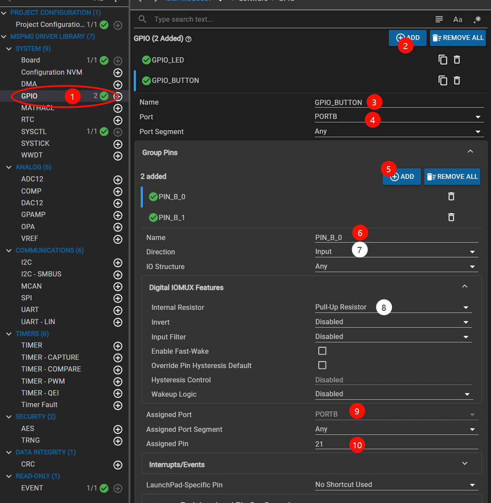

## 2. Systick循环中断

* Sys遵循的时钟：MCLK，而MCLK遵循的是SYSOC：32MHz，所以最终SYS的频率为32MHz

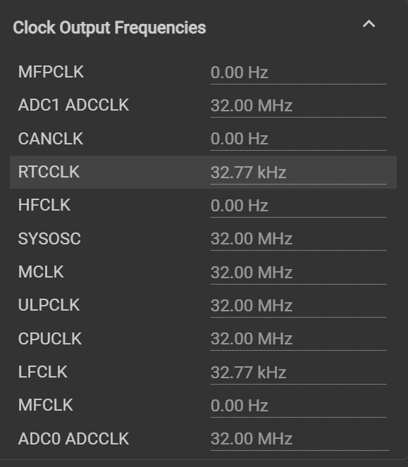

* 配置

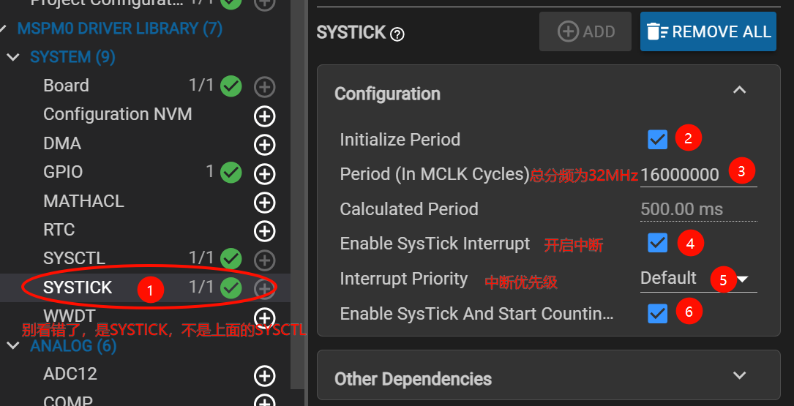

* 基础代码

```c
void SysTick_Handler(void)
{
    // 操作
    
}
```


## 3. TIM

### 3-1 TIM-中断定时

* 上半部分：

  * TIMA0是时钟源，与STM32不同，我们不需要太刻意关注时钟源，因为周期可以自己写，系统会配置PSC和ARR

  * 关于分频：Clock Config
    * 频率越低，计数最大时间越长
    * 频率越高，计数最小时间越小
    * 分频有两个选项都能设置

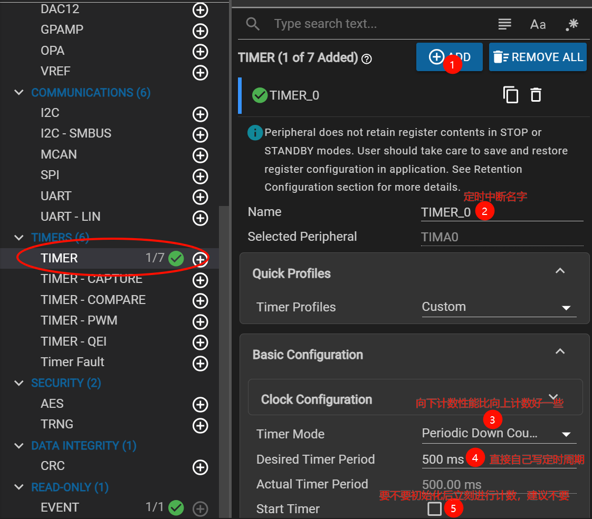

* 下半部分
  * 重复计数记得打开
  * 分频必须开，并且不能是1分频
  * 优先级自己配

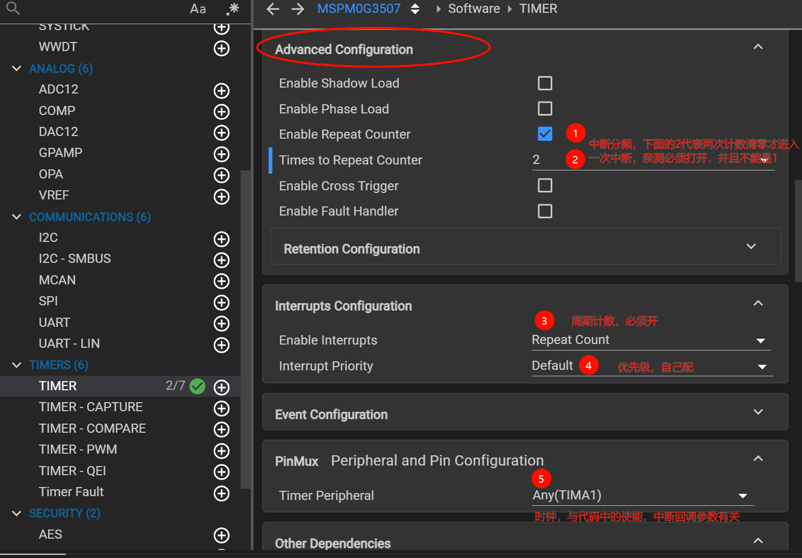

* 基础代码

```c
// 注意：根据中断名字进行配置：TIMERx

// setup
NVIC_EnableIRQ(TIMER_0_INST_INT_IRQN);	// 开启中断
DL_TimerA_startCounter(TIMER_0_INST);	// 开始周期计数

// 自定义：__week
void TIMER_0_INST_IRQHandler(void)
{
    switch (DL_TimerA_getPendingInterrupt(TIMER_0_INST)) // 中断查询状态
    {
        // 检测到重复计数模式
        case DL_TIMERA_IIDX_REPEAT_COUNT:                
        {
            DL_GPIO_togglePins(GPIO_LEDS_PORT,GPIO_LEDS_USER_LED_1_PIN);
            break;	// 记得break;
        }
        // 其他模式
        default:
            break;
    }
}
```

### 3-2 TIM外部中断

* 参考资料：https://blog.csdn.net/wxg_wuchujie88/article/details/149454292

* 先介绍MSPM0的事件系统：
  * **Publisher（发布者）**：产生事件的外设
  * **Subscriber（订阅者）**：响应事件的外设
  * **Channel（通道）**：事件传播的“线路”

```c
GPIO / Timer / ADC
        ↓
   Event Channel // 所以Subscriber不会知道是谁发布的事件，只知道事件触发了
        ↓	     // 事件通道的分配策略：结果相同，通道可以相同：比如3个按键都是触发一个功能，那么通道就给一样
 PWM / Timer / DMA / Comparator

```

***

* 外部触发中断逻辑

* 外设中断分组

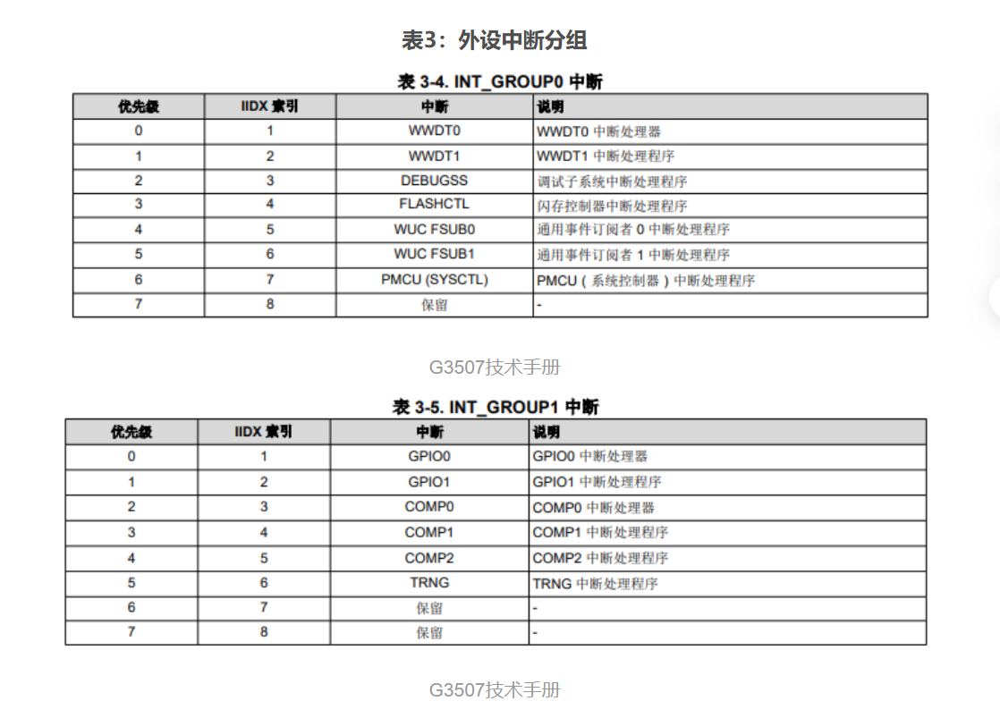

​	看的出来，GPIO的外部中断都被分在了GROUP1中，所以后续也是调用`GROUP1_IRQHandler`句柄

* ==关于外部中断的核心处理逻辑：（假设PB21触发了外部中断）==
  * 触发：**`GROUP1_IRQHandler`**句柄，**也就是这个小组有人触发了外部中断**
    * 对应实现：`void GROUP1_IRQHandler(void)`
  * 查询端口：GROUP中是**哪一个小队触发了中断**，对于GPIO来说就是检查是**哪一个Port**触发了外部中断
    * 对应函数：`switch (DL_Interrupt_getPendingGroup(DL_INTERRUPT_GROUP_1))`
    * 返回的case最重要的就是查询是A还是B触发的
      * `case DL_INTERRUPT_GROUP1_IIDX_GPIOA:`  // GPIOA中断
      * `case DL_INTERRUPT_GROUP1_IIDX_GPIOB:`  // GPIOB中断
  * 查询引脚：查询到了是`PortB`触发的，再去找是PB几，**也就是寻找小队里面的队员**
    * case下的对应函数：`uint32_t status = DL_GPIO_getEnabledInterruptStatus(GPIOB);`
    * 这个函数返回的就是引脚号(PIN_21的引脚号就是1<<21)
    * 查询引脚号：`if (status & GPIO_PIN_21) {实现功能}`
  * 实现完成功能记得**清除标志位**
    * `DL_GPIO_clearInterruptStatus(GPIOB ， PBx)`
* 简单来说就是
  * GROUP1函数触发 -> 查GROUP1内端口（A or B） -> 查端口内引脚（0-31）

***

* 配置

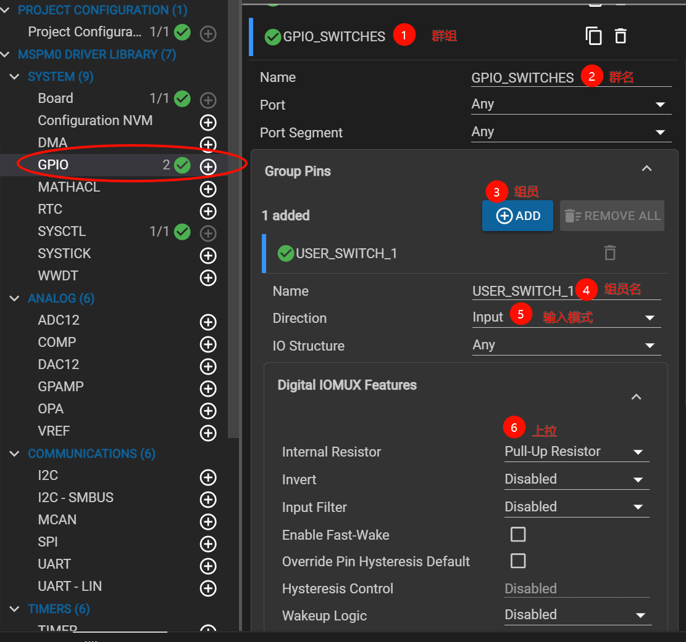

* 下半部分

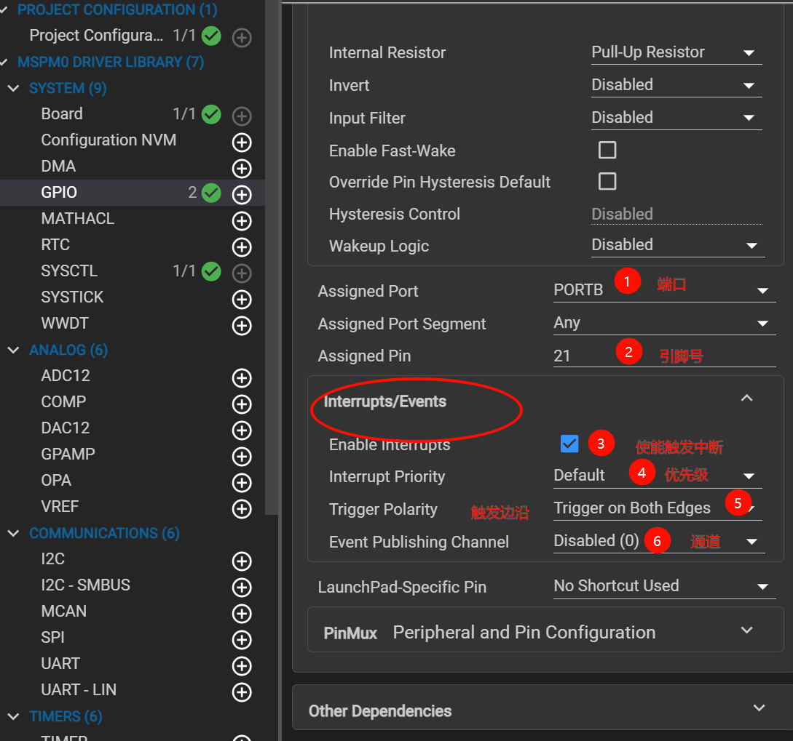

* 基础代码
  * GPIO中断触发都是GRP1线，所以句柄是Group1

```c
// setup
NVIC_EnableIRQ(GPIOA_INT_IRQn);	// 外部中断触发使能,其实也只有GPIOA和GPIOB两个IRQn，使用哪个端口就使能哪一个

// GPIOA和GPIOB的触发中断都存在于GRP1中，所以触发句柄都是GRP1
void GROUP1_IRQHandler(void)
{
    // 检查GROUP_1中是谁开启的中断
    switch (DL_Interrupt_getPendingGroup(DL_INTERRUPT_GROUP_1)) 
    {
        // 这个其实是封装过了,应该是GPIOB的IIDX：DL_INTERRUPT_GROUP1_IIDX_GPIOB
        case GPIO_SWITCHES_INT_IIDX:
            // 检测是GPIOB的哪一个引脚触发的中断,返回值：GPIO_PIN
            status = DL_GPIO_getEnabledInterruptStatus(GPIO_SWITCHES_PORT,GPIO_SWITCHES_USER_SWITCH_1_PIN) ;
            if (status & GPIO_SWITCHES_USER_SWITCH_1_PIN)
            {
				// 自己搞操作
                
                DL_GPIO_clearInterruptStatus(GPIO_SWITCHES_PORT,GPIO_SWITCHES_USER_SWITCH_1_PIN);
            }
            break;
        //case DL_INTERRUPT_GROUP1_IIDX_GPIOA:
            // A端口状态查询
    }
}
```

### 3-3 TIM输出比较

* 上半部分
  * 时钟外设选择TIMG0，要在最下面选择，图示略

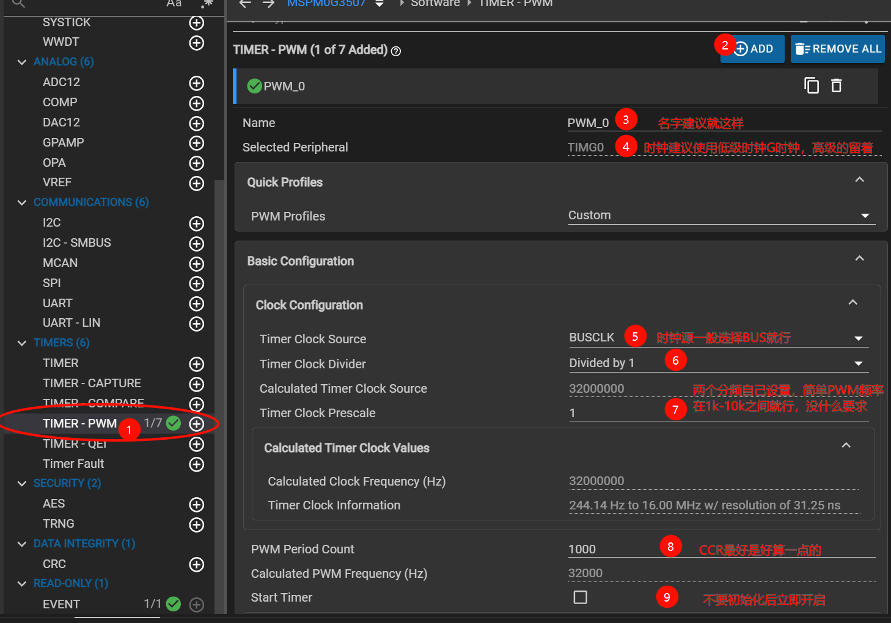

* 下半部分

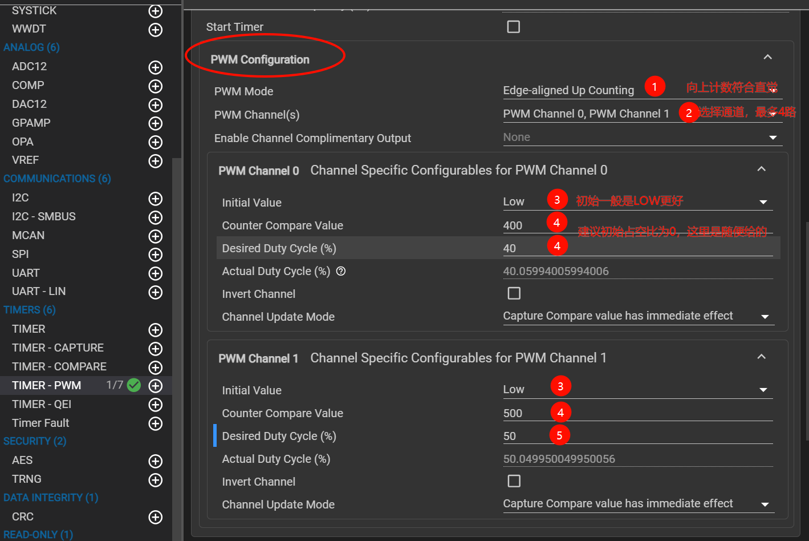

* 基础代码

```c
// setup
DL_TimerG_startCounter(PWM_0_INST);	// 初始化TIM时钟，在本例就是TIMG0

// while
// 配置占空比:参数：PWM时钟源 , PWM_x , 通道x
DL_TimerG_setCaptureCompareValue(PWM_0_INST, PWM_0, DL_TIMER_CC_0_INDEX);
// 自定义频率:参数：PWM时钟源 , 频率
DL_TimerG_setLoadValue(PWM_0_INST , 2000) ;
```


### 3-4 TIM输入捕获

* 使用较少，略

### 3-5 TIM编码器模式


## 4. USART

### 4-1 中断式

* 上半部分

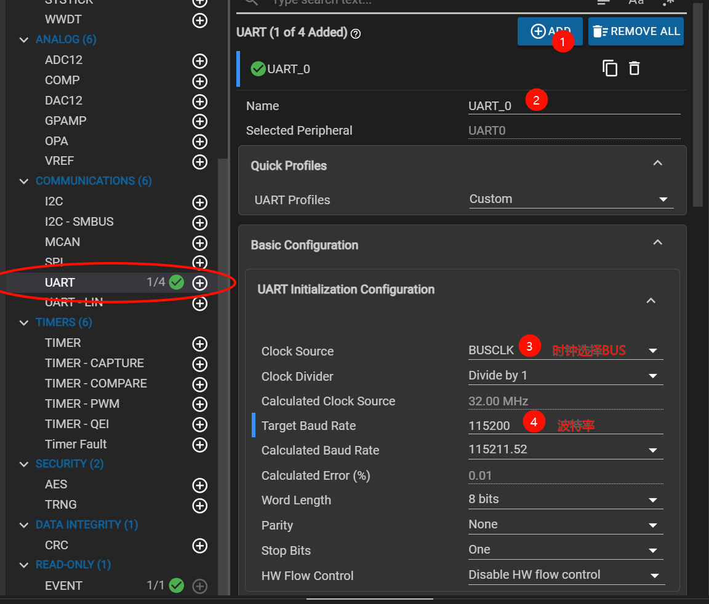

* 下半部分

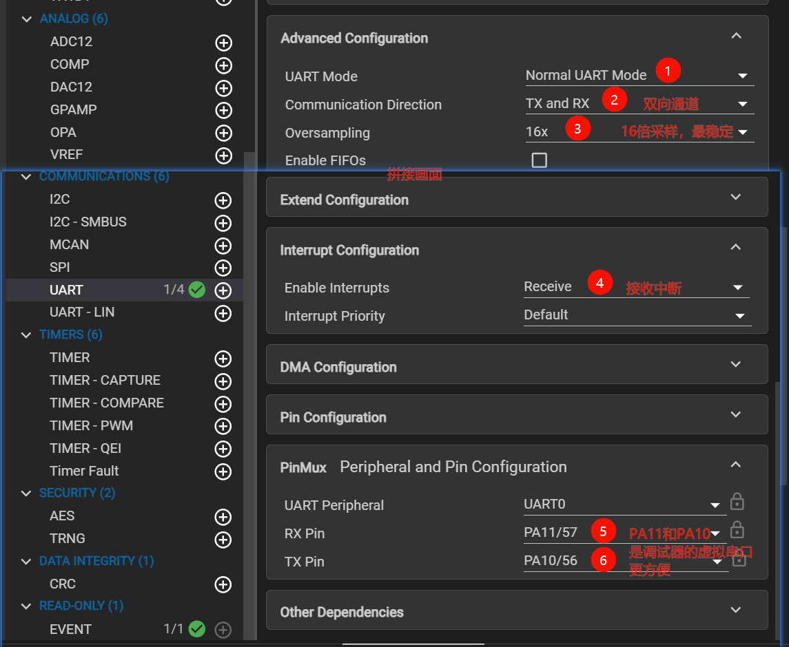

* 示例代码

```c
// setup
// 先清除发送,再使能发送
NVIC_ClearPendingIRQ(UART_0_INST_INT_IRQN);	// 初始化,防止上来就进入中断
NVIC_EnableIRQ(UART_0_INST_INT_IRQN);

// 中断句柄
void UART_0_INST_IRQHandler(void)	// 根据中断选择USART_x
{
    switch (DL_UART_Main_getPendingInterrupt(UART_0_INST)) 
    {
        // 接收中断
        case DL_UART_MAIN_IIDX_RX:
            DL_GPIO_togglePins(GPIO_LEDS_PORT,GPIO_LEDS_PIN_LED_1_PIN);
            // 必须存储接收到信息,即使不使用,否则中断FIFO存不下，再也进不去中断了
            gEchoData = DL_UART_Main_receiveData(UART_0_INST);  
            // 发送回显
            DL_UART_Main_transmitData(UART_0_INST, gEchoData);
            break;
        // 一般来说用不上发送中断
        default:
            break;
    }
}
```


## 5. IIC

## 5-1 软件模拟IIC


